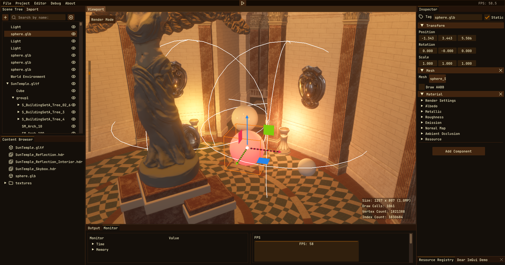
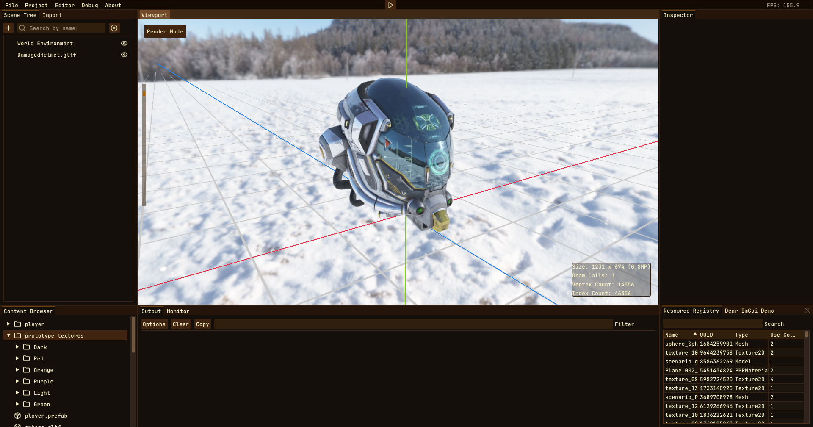
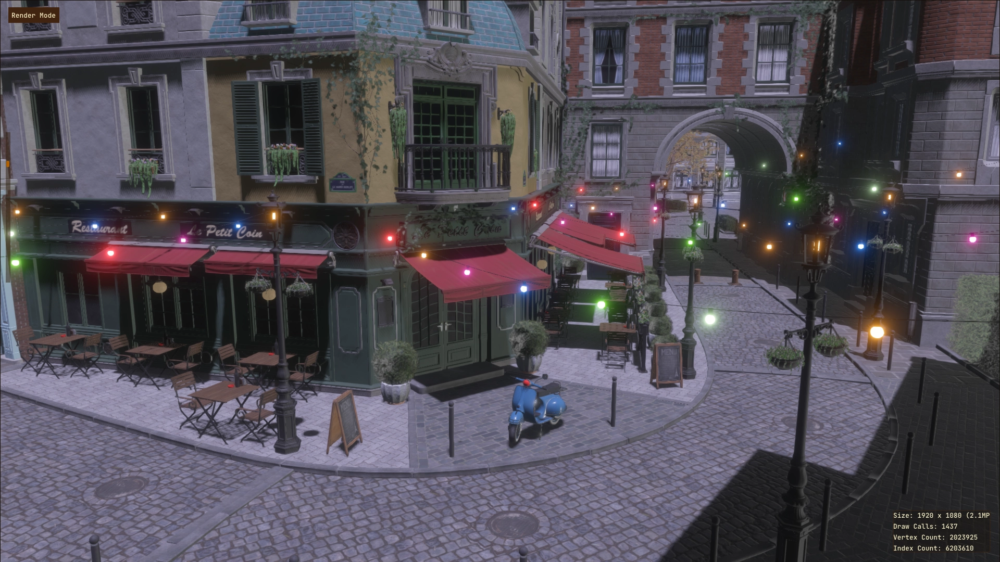
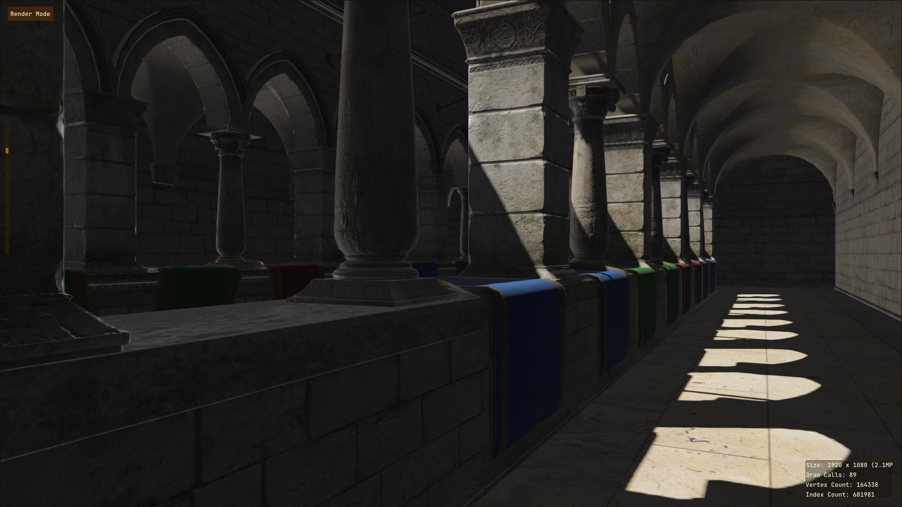

# Coffee Engine
[](https://github.com/Burned-Games/Coffee-Engine/actions/workflows/publish-docs.yml)

<p align="center">
    
</p>

**Coffee Engine is a Beautiful and Cross-platform 3D Game Engine written in C++ using OpenGL and SDL3.** </br> 

> [!IMPORTANT]
> This is a university project for learning how to make a 3D game engine.

# Screenshots

|  |  |
| --- | --- |
|  |  |

# Documentation

📚 **[Read the full documentation](https://brewing-team.github.io/Coffee-Engine/)** - Complete API reference, tutorials, and guides

he documentation includes:
- **Getting Started**: Setup guides for different IDEs (CLion, Visual Studio, VS Code)
- **API Reference**: Complete class documentation generated with Doxygen
- **Architecture**: Core systems, rendering pipeline, and engine modules
- **Contributing**: Code style guidelines and development setup


# Getting Started

Any IDE or Text Editor that supports CMake Projects (and vcpkg) should work for developing the project.

## Building

### 1. Clone the repository
```
git clone --recursive https://github.com/Brewing-Team/Coffee-Engine.git
cd Coffee-Engine
```

### 2. Compilation
<details>
  <summary>Windows</summary>
There are a lot of ways to do it. From installing all the necessary packages for building it (cmake, vcpkg, a compiler...), to using a IDE environment. My recomendation is to use an IDE environment if what you want is an straightforward way to compile the project.

#### Instructions to compile the project using an IDE

##### Visual Studio 2022
1. Open the folder with Visual Studio 2022
2. Enable vcpkg integration. More info at https://devblogs.microsoft.com/cppblog/vcpkg-is-now-included-with-visual-studio.
3. Reconfigure the cmake project. If the output panel display something like ```running vcpkg install``` then you are ready to go to the next stage.
4. Wait until all the dependencies are installed by vcpkg.
Then select on the top play button the Coffee-Editor.exe and run it.
5. Go to the "bin/Coffee-Engine/<build type>" folder
6. Congratulations! You have built Coffee-Engine for the first time!

##### CLion
1. Open the folder with CLion
2. ...
    
</details>
<details>
  <summary>Linux</summary>

#### 1. Install vcpkg

##### Clone vcpkg
```
git clone https://github.com/microsoft/vcpkg.git
cd vcpkg
```
##### Run the bootstrap
```
./bootstrap-vcpkg.sh
```

##### Enable the vcpkg instance
```
./vcpkg integrate install
```
> Sometimes this will not automatically add the VCPKG_ROOT environment variable!

##### For more info take a look at https://learn.microsoft.com/en-us/vcpkg/get_started/get-started?pivots=shell-powershell

#### 2. Build
```
mkdir build && cd build
cmake .. -DCMAKE_BUILD_TYPE=Release
make -j $(nproc) CoffeeEditor
```
#### 3. Enjoy!
```
cd ../bin/CoffeeEditor/Release
./CoffeeEditor
```
</details>

# Features

## **Architecture**
- [x] **CoffeeEngine Core Library**: Modular engine architecture
- [x] **CoffeeEditor**: Full-featured game editor
- [x] **Cross-Platform Support**: Windows and Linux compatibility

## **Rendering**

### **3D Rendering**
- [x] **Forward Rendering Pipeline**: Modern Renderer3D implementation
- [x] **PBR Materials**: Physically-based rendering workflow
- [x] **Shader Materials**: Custom shader support
- [x] **Textures**: Complete texture loading and management
- [x] **Skybox**: HDR environment mapping
- [x] **HDR Rendering**: High dynamic range pipeline

### **Post-Processing**
- [x] **FXAA**: Fast approximate anti-aliasing
- [x] **Bloom**: Physically Based Bloom
- [x] **Fog**: Atmospheric depth rendering
- [x] **Tone Mapping**: AgX tone mapping for cinematic color

### **Lighting & Shadows**
- [x] **Directional Lights**: Sun-like lighting with shadows
- [x] **Point Lights (Omni)**: 360-degree light sources
- [x] **Spot Lights**: Cone-based directional lighting
- [x] **Directional Shadows**: Real-time shadow mapping
- [x] **Image-Based Lighting (IBL)**: Environment lighting
- [x] **Frustum Culling**: Octree-based optimization

### **2D Rendering**
- [x] **Renderer2D**: Optimized 2D sprite rendering
- [x] **2D Batching**: Automatic draw call optimization

## **Game Systems**

### **Entity Component System (ECS)**
- [x] **EnTT Integration**: High-performance entity management
- [x] **Scene Tree**: Hierarchical scene organization
- [x] **Component System**: Modular game object composition
- [x] **Model Loading**: 3D asset import and management

### **Animation System**
- [x] **3D Skeletal Animation**: Bone-based character animation
- [x] **Animation Blending**: Smooth state transitions
- [x] **Partial Animation Blending**: Layer-based body part animation

### **Prefab System**
- [x] **Reusable Templates**: Component-based game object templates
- [x] **Hierarchy Preservation**: Parent-child relationships
- [x] **Cross-Component References**: Automatic reference integrity
- [x] **Human-Readable Serialization**: `.prefab` format with version control
- [x] **Runtime Instantiation**: Dynamic prefab spawning

## **Audio**
- [x] **Wwise Integration**: Professional audio middleware
- [x] **3D Spatial Audio**: Positional audio with distance attenuation
- [x] **RTPCs**: Real-time parameter controls
- [x] **Audio Banks & Events**: Organized audio asset management
- [x] **Auxiliary Sends**: Game-defined audio routing

## **Navigation**
- [x] **Pathfinding System**: AI navigation with obstacle avoidance
- [x] **Navmesh Generation**: Automatic navigation mesh creation

## **Physics**
- [x] **Bullet Physics Integration**: Industry-standard physics simulation
- [x] **Rigid Body System**: Static, dynamic, and kinematic bodies
- [x] **Collision Detection**: Enter/stay/exit events with manifolds
- [x] **Multiple Collider Types**: Box, Sphere, Capsule, Cylinder, Cone
- [x] **Raycasting API**: Single/multiple hit detection
- [x] **Physics Debugging**: Visual collision shapes and raycast debug

## **Scripting**
- [x] **Lua Integration**: Sol2-powered C++/Lua interoperability
- [x] **Advanced Bindings**: Automatic type conversions and error handling
- [x] **IntelliSense Support**: Auto-generated stub files
- [x] **Language-Agnostic Design**: Extensible for additional languages
- [x] **Entity Integration**: Direct script binding to game objects

## **Development Tools**

### **Resource Management**
- [x] **Asset Pipeline**: Automatic import and processing
- [x] **Resource Caching**: Intelligent asset loading
- [x] **Hot Reloading**: Real-time asset updates

### **Editor Features**
- [x] **Scene Hierarchy**: Visual scene graph management
- [x] **Component Inspectors**: Real-time property editing
- [x] **Asset Browser**: Resource management interface
- [x] **Viewport**: 3D scene visualization

### **Profiling & Debugging**
- [x] **Tracy Integration**: Real-time performance profiling
- [x] **Debug Rendering**: Visual debugging systems
- [x] **Console & Logging**: Integrated debugging tools

### **Serialization & Persistence**
- [x] **Scene Serialization**: Complete scene save/load system
- [x] **Cereal Library**: Robust versioned serialization

## Acknowledgements

This project makes use of several open-source libraries and resources that have greatly contributed to its development. Special thanks to the creators and maintainers of the following:

- **[spdlog](https://github.com/gabime/spdlog)**: Fast C++ logging library.
- **[SDL3](https://github.com/libsdl-org/SDL)**: Cross-platform development library made by [libsdl.org](https://libsdl.org/).
- **[GLM](https://github.com/g-truc/glm)**: OpenGL Mathematics library for graphics software.
- **[GLAD](https://github.com/Dav1dde/glad)**: Multi-language OpenGL loader-generator.
- **[ImGui](https://github.com/ocornut/imgui)**: Immediate Mode Graphical User Interface for C++.
- **[stb_image](https://github.com/nothings/stb)**: Image loading library.
- **[assimp](https://github.com/assimp/assimp)**: Library to import various well-known 3D model formats.
- **[EnTT](https://github.com/skypjack/entt)**: Fast and reliable entity-component system (ECS).
- **[Tracy](https://github.com/wolfpld/tracy)**: Real-time, nanosecond resolution, remote telemetry, hybrid frame and sampling profiler.
- **[LearnOpenGL](https://learnopengl.com/)**: Comprehensive OpenGL tutorial and resource site.
- **[Hazel](https://github.com/TheCherno/Hazel)**: A small game engine developed by TheCherno as part of his game engine series.
- **[Godot](https://godotengine.org/)**: An advanced, feature-packed, multi-platform 2D and 3D open-source game engine.
- **[skypjack on software](https://skypjack.github.io/)**: Blog and resources on software development by skypjack. 

## License

This project is licensed under the MIT License - see the [LICENSE](LICENSE) file for details.
